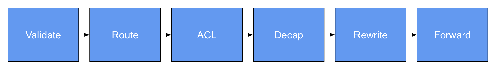

# Overview

In this lab, you will fill in some missing code to complete a P4
description of a pipeline specified informally.

# Code Organization

* [headers.p4](headers.p4): Type definitions for packet headers (provided)
* [parde.p4](parde.p4): Packet parsers and deparsers (provided)
* [checksum.p4](checksum.p4): Code to verify and update the IPv4 checksum (provided)
* [mystery.p4](mystery.p4): Top-level program that integrates all components (provided)
* [tests/](tests/): Directory of executable tests for the pipeline (provided)
* [execute.sh](execute.sh): Script to run a test using a P4 software model (provided)
* [pipeline.p4](pipeline.p4): Partial implementation of the packet-processing pipeline (your code goes here!)

# Pipeline Specification

The top-level pipeline is implemented in terms of several smaller
blocks, which are composed in sequence:



## Headers

The pipeline supports packets (a subset of) the following headers:

* Ethernet
* VLAN
* IPv4
* IPv6
* TCP
* UDP
* "Inner" IPv4, for 4-in-6 tunneling

```p4
struct headers_t {
    ethernet_t ethernet;
    vlan_t     vlan;
    ipv4_t     ipv4;
    ipv6_t     ipv6;
    ipv4_t     innerIpv4;
    tcp_t      tcp;
    udp_t      udp;
}
```

## Metadata

The user-defined metadata contains various information used for packet
processing including: values to indicate which processing should be
performed (e.g., `decap, `rewrite`, `forward`, etc.), normalized
values extracted from packet data (e.g., `l3Protocol`, `l4SrcPort`,
`l4DstPort`, etc.), and values for the final packet at the end of the
pipeline (e.g., `newDstAddr` and `egressPort`):

```p4
struct metadata_t {
    bool    validated;
    bool    decap;
    bool    rewrite;
    bool    forward;
    bit<12> vlan;
    bit<8>  l3Protocol;
    bit<16> l4SrcPort;
    bit<16> l4DstPort;
    bit<48> newDstAddr;
    bit<8>  newTtl;
    bit<9>  egressPort;
}
```

## Tables

It has the following tables, which can be populated with entries by
the control plane.

### Validation

The `validate` table that the packet is well-formed. It is typically
used to check that the packets arriving on each port have the VLAN
associated, with that port and that headers have the expected format
-- e.g., if the Inner IPv4 header is valid then the IPv6 header is
valid too. A packet that fails validation will ultimately be dropped.

```p4
table validate {
    key = {
        standard_metadata.ingress_port: exact;
        headers.ethernet.etherType : exact;
        headers.vlan.vlanId : ternary;
        headers.vlan.etherType : ternary;
        headers.vlan.isValid() : exact;
        headers.ipv4.isValid() : exact;
        headers.ipv6.isValid() : exact;
        headers.innerIpv4.isValid() : exact;
    }
    actions = { setValidated; setValidatedAndUntag; NoAction; }
    default_action = NoAction();
}
```

### Routing

The routing tables determines the output port for IPv4 and IPv6
packets. It also populates user-defined metadata with information
about packet modifications, such as decrementing the time-to-live
field, which are executed at the end of the pipeline.

There are separate tables for IPv4,
```p4
table ipv4Route {
    key = {
        headers.ipv4.dstAddr : ternary;
    }
    actions = {
        setForwarding;
        NoAction;
    }
    default_action = NoAction();
}
```
and IPv6:
```p4
table ipv6Route {
    key = {
        headers.ipv6.dstAddr : ternary;
    }
    actions = {
        setForwarding;
        NoAction;
    }
    default_action = NoAction();
}
```

### Tunnel Decap

The tunnel decapsulation table determines whether packets for a 4-in-6
tunnel should be terminated.

```p4
table decap {
    key = {
        headers.ipv6.dstAddr : ternary;           
    }
    actions = { setDecap; NoAction; }
    default_action = NoAction();
}
```

### ACL

The `acl` table filters packets according to control-plane specified
policies. It can match against most headers.

```p4
table acl {
    key = {
        standard_metadata.ingress_port : ternary;
        metadata.egressPort : ternary;
        metadata.vlan : ternary;
        headers.ethernet.srcAddr : exact;
        headers.ethernet.dstAddr : exact;
        headers.ethernet.etherType : exact;
        headers.ipv4.srcAddr : ternary;
        headers.ipv4.dstAddr : ternary;
        headers.ipv4.ttl : ternary;
        headers.ipv6.srcAddr : ternary;
        headers.ipv6.dstAddr : ternary;
        headers.ipv6.hopLimit : ternary;
        metadata.l3Protocol : ternary;
        metadata.l4SrcPort : ternary;
        metadata.l4DstPort : ternary;
    }
    actions = { allow; deny; }
    default_action = deny();
}

```

# Rewrite

The `rewrite` block implements packet rewrites, including tunnel
decapsulation. It is not implemented as a match-action table, but
rather given directly as P4 code.

# Forward

The `tag` table in the Forward block optionally adds a VLAN header to
packets that should be forwarded, and also sets the egress port.

```p4
table tag {
    key = {
        standard_metadata.ingress_port: exact;
    }
    actions = { setTag; NoAction; }
    default_action = NoAction();
}
```

# Executing Tests

To execute a test, simply invoke the `execute.sh` script on the
corresponding test file. For example:

```
% execute.sh tests/mystery_0.stf
```

# Implementation Hints

* Most of the code including header definitions, parsers and
  deparsers, checksums, etc. have been provided for you.

* The only file you need to modify is [pipeline.p4](pipeline.p4) and
  the `TODO` indicate where modifications are needed.

* Pay attention to the packet metdata and the validity of headers, and
  keep in mind that all packet modifications are performed at the
  _end_ of the pipeline. 
